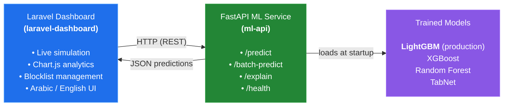

# Fraud Bank — Financial Fraud Detection System

An end-to-end fraud detection system combining a production-style **machine learning service** with a **bilingual operations dashboard**. Built as a graduation project (Feb–Jul 2026) at Al-Wataniya Private University.

The system takes raw financial transactions, scores them for fraud risk in real time via a served ML model, and surfaces the results through a live, bilingual (Arabic/English) analytics dashboard.

---

## Architecture
 

 
## Overview

- **Data scale:** 5 million financial transactions
- **Feature engineering:** 30+ engineered features
- **Model selection:** 4 candidate models benchmarked (Random Forest, XGBoost, LightGBM, TabNet) — **LightGBM** selected for production based on the best F1-score and fastest inference latency, with a decision threshold tuned to 0.94
- **Serving:** FastAPI service with a 9-step preprocessing pipeline, exposing `predict`, `batch-predict`, `explain`, and `health` endpoints
- **Dashboard:** Bilingual (Arabic/English) Laravel application with live transaction simulation and Chart.js-based analytics

## Repository Structure

```
fraud-bank/
├── ml-api/                 # FastAPI inference service + trained models
├── laravel-dashboard/      # Bilingual dashboard (Blade + Chart.js)
├── docs/                   # Diagrams and supporting documentation
└── README.md               # You are here
```

Each subproject has its own README with detailed setup instructions:
- [`ml-api/README.md`](./ml-api/README.md)
- [`laravel-dashboard/README.md`](./laravel-dashboard/README.md)

## Tech Stack

| Layer            | Technology                                                        |
|-------------------|--------------------------------------------------------------------|
| ML / Inference    | Python, FastAPI, Pandas, Scikit-learn, XGBoost, LightGBM, TabNet    |
| Backend Dashboard | PHP, Laravel                                                       |
| Frontend          | Blade, Chart.js, Tailwind CSS                                      |
| Data              | Parquet (lookup tables), SQLite                                    |

## Quick Start

1. Start the ML API — see [`ml-api/README.md`](./ml-api/README.md)
2. Start the Laravel dashboard — see [`laravel-dashboard/README.md`](./laravel-dashboard/README.md)
3. Point the dashboard's `.env` at the running ML API (`FRAUD_API_URL`)

## Author

**Zain Wahbi** — Backend & ML Engineer
[GitHub](https://github.com/Zain-Wahbi) · [LinkedIn](https://linkedin.com/in/zain-wahbi) · [Portfolio](https://zain-wahbi.github.io/zain-wahbi-portfolio)

**Hussein Alahmad**
[GitHub](https://github.com/Hussein89hu)
