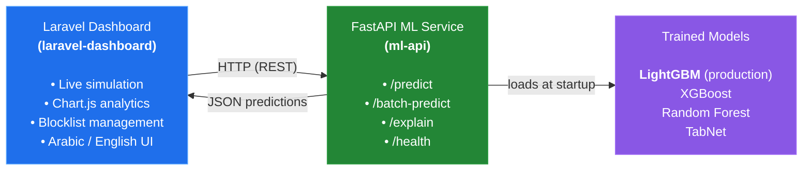
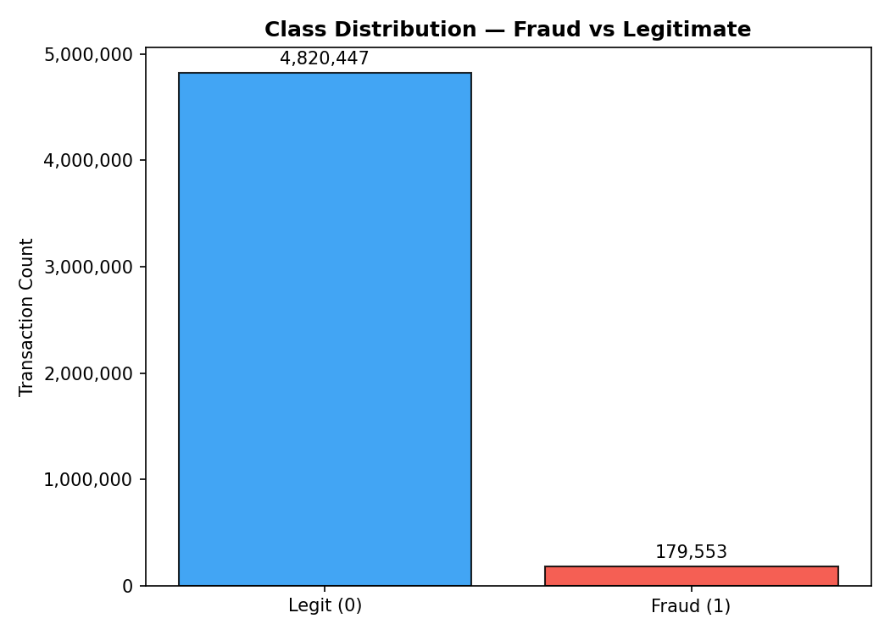
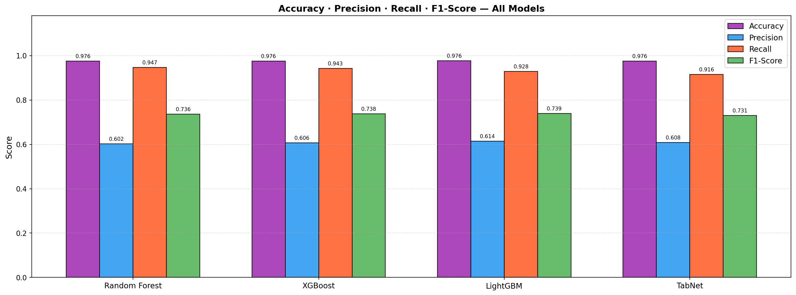
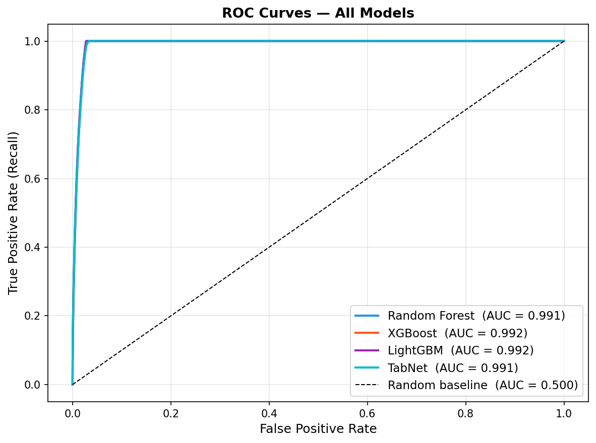
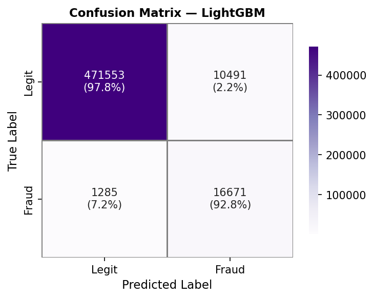
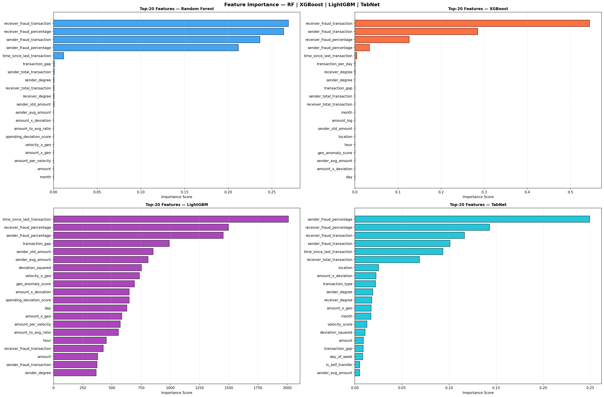

# Fraud Bank — Financial Fraud Detection System

An end-to-end fraud detection system combining a production-style **machine learning service** with a **bilingual operations dashboard**. Built as a graduation project (Feb–Jul 2026) at Al-Wataniya Private University.

The system takes raw financial transactions, scores them for fraud risk in real time via a served ML model, and surfaces the results through a live, bilingual (Arabic/English) analytics dashboard.

---

## Architecture



## Overview

- **Data scale:** 5 million financial transactions
- **Feature engineering:** 30+ engineered features
- **Model selection:** 4 candidate models benchmarked (Random Forest, XGBoost, LightGBM, TabNet) — **LightGBM** selected for production (see [Model Performance](#model-performance) for full metrics)
- **Serving:** FastAPI service with a 9-step preprocessing pipeline, exposing `predict`, `batch-predict`, `explain`, and `health` endpoints
- **Dashboard:** Bilingual (Arabic/English) Laravel application with live transaction simulation and Chart.js-based analytics

## Dataset

The model was trained on the [Financial Transactions Dataset for Fraud Detection](https://www.kaggle.com/datasets/aryan208/financial-transactions-dataset-for-fraud-detection) (Kaggle) — ~5 million transactions. The raw dataset is not included in this repository due to its size; see [`model-training/README.md`](./model-training/README.md) for how to use it.

## Model Performance

Four candidate models were trained and evaluated on a held-out test set, each with an independently optimized decision threshold:

| Model         | Accuracy | Precision | Recall | F1-Score | ROC-AUC | AP (AUCPR) | Threshold |
|---------------|:--------:|:---------:|:------:|:--------:|:-------:|:----------:|:---------:|
| Random Forest |  0.9756  |   0.6020  | 0.9471 |  0.7361  |  0.9915 |   0.7456   |   0.920   |
| XGBoost       |  0.9759  |   0.6062  | 0.9427 |  0.7379  |  0.9918 |   0.7667   |   0.935   |
| **LightGBM**  |**0.9764**| **0.6138**|**0.9284**|**0.7390**|**0.9919**| **0.7674** | **0.940** |
| TabNet        |  0.9757  |   0.6077  | 0.9157 |  0.7306  |  0.9914 |   0.7593   |   0.820   |

**LightGBM** was selected for production — it achieves the best F1-Score, ROC-AUC, and AP (AUCPR) among all four candidates, with a decision threshold optimized to **0.940**.

<p align="center">
  
  
</p>
<p align="center">
  
  
</p>
<p align="center">
  
</p>

*Left to right, top to bottom: class distribution (fraud vs. legitimate), model comparison across all metrics, ROC curves for all four models, LightGBM confusion matrix, feature importance. Full analysis in [`model-training/`](./model-training/).*

## Repository Structure

```
fraud-bank/
├── ml-api/                 # FastAPI inference service + trained models
├── laravel-dashboard/      # Bilingual dashboard (Blade + Chart.js)
├── docs/                   # Diagrams and supporting documentation
└── README.md               # You are here
```

Each subproject has its own README with detailed setup instructions:
- [`ml-api/README.md`](./ml-api/README.md)
- [`laravel-dashboard/README.md`](./laravel-dashboard/README.md)

## Tech Stack

| Layer            | Technology                                                        |
|-------------------|--------------------------------------------------------------------|
| ML / Inference    | Python, FastAPI, Pandas, Scikit-learn, XGBoost, LightGBM, TabNet    |
| Backend Dashboard | PHP, Laravel                                                       |
| Frontend          | Blade, Chart.js, Tailwind CSS                                      |
| Data              | Parquet (lookup tables), SQLite                                    |

## Quick Start

1. Start the ML API — see [`ml-api/README.md`](./ml-api/README.md)
2. Start the Laravel dashboard — see [`laravel-dashboard/README.md`](./laravel-dashboard/README.md)
3. Point the dashboard's `.env` at the running ML API (`FRAUD_API_URL`)

## Author

**Zain Wahbi** — Backend & ML Engineer
[GitHub](https://github.com/Zain-Wahbi) · [LinkedIn](https://linkedin.com/in/zain-wahbi) · [Portfolio](https://zain-wahbi.github.io/zain-wahbi-portfolio)

**Hussein Alahmad**
[GitHub](https://github.com/Hussein89hu)